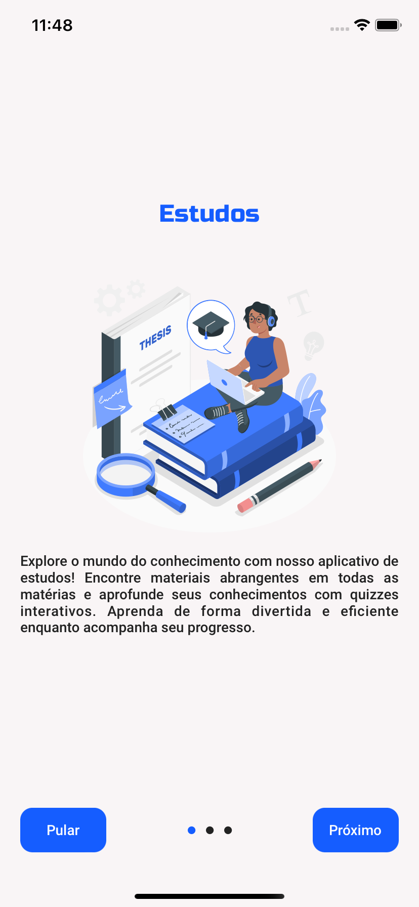
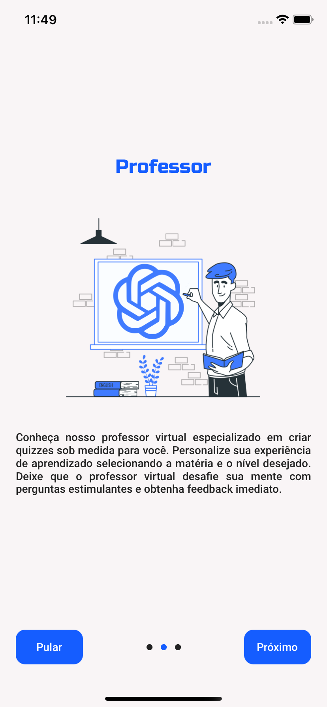
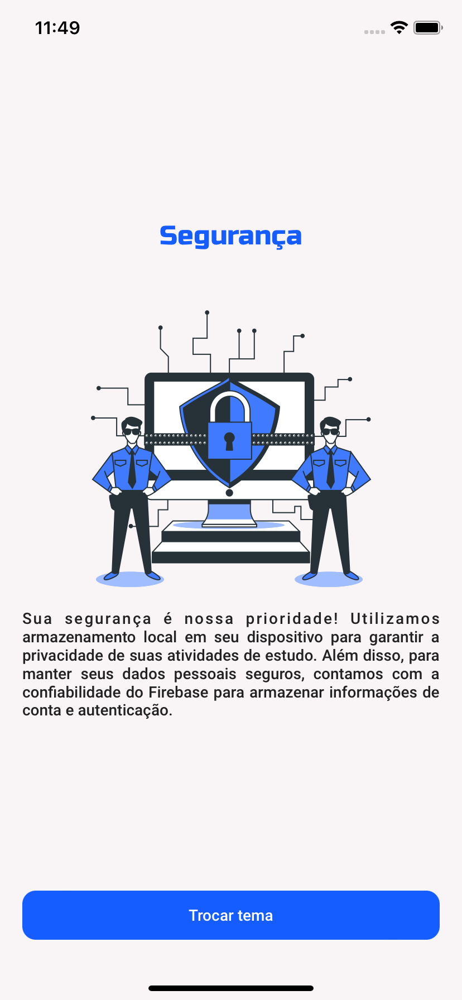
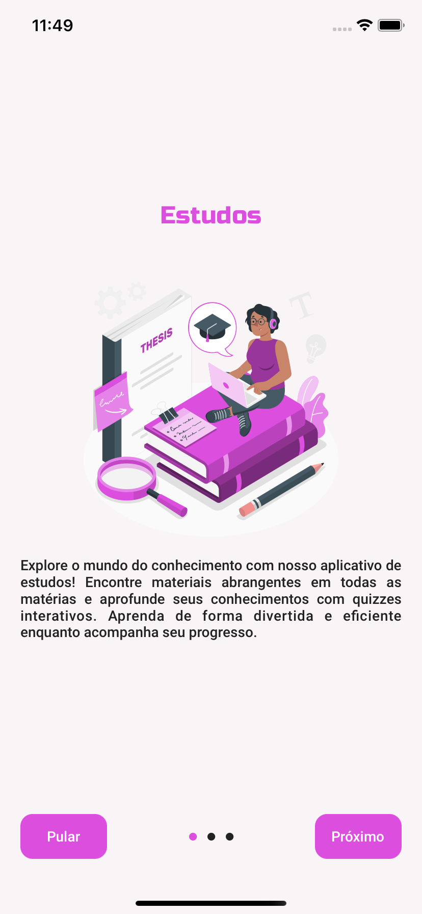
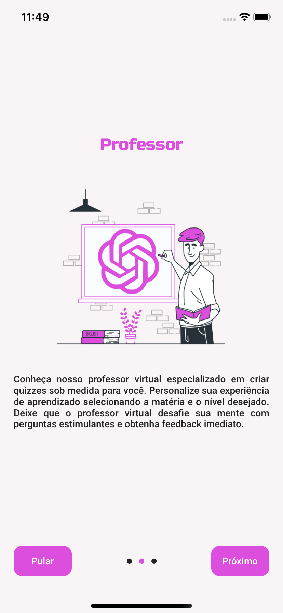
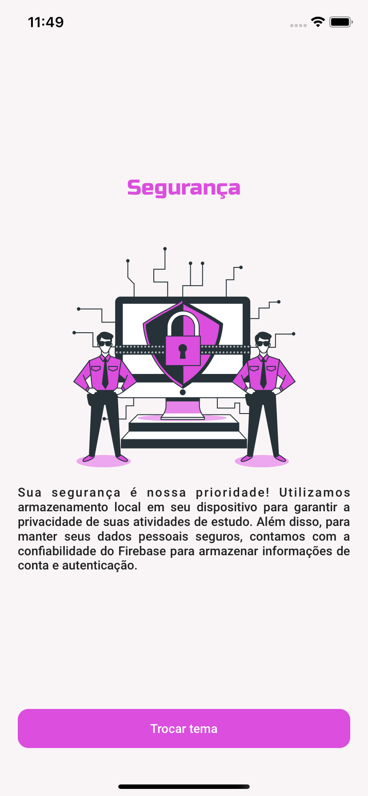
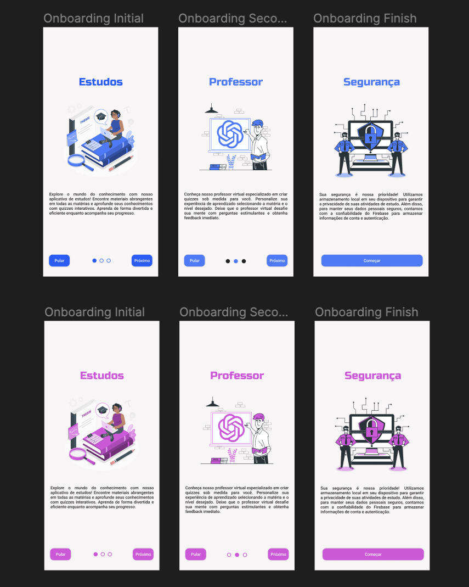

# SWIFT - MVVM - Theme Manager Onboarding - Switch Multiple Themes

 

Project repository **Theme Manager** development with **Swift, UIKit, MVVM, Delegate, ViewCode, Constraints, Design Pattern, Custom Components**

<h3 id="acessar-projeto">📁 Preview</h3>

    

    
   &nbsp;&nbsp;&nbsp;&nbsp;&nbsp;&nbsp;
  
   &nbsp;&nbsp;&nbsp;&nbsp;&nbsp;&nbsp;
  

     

    
   &nbsp;&nbsp;&nbsp;&nbsp;&nbsp;&nbsp;
  
   &nbsp;&nbsp;&nbsp;&nbsp;&nbsp;&nbsp;
  

 
<h3 id="acessar-projeto">📁 Initializing Clone</h3>

◽ Clone the repository using Git Bash + the command:

       $ git clone git@github.com:IMatheusPiresI/swift-theme-manager-onboarding.git

<h3 id="sobre">📍 About</h3>

✅ Developed with **Swift, UIKit, MVVM, Delegate, ViewCode, Constraints, Design Pattern, Custom Components**. 
✅ Project created using MVVM pattern and delegate protocol. 
✅ Use notification center for notify controllers and components about theme change.  
✅ ThemeManager create for switch multiple themes in application 
✅ Create methods for apply, update and change theme in real time. 
✅ Create custom base components for App (Typograph and Button) 
✅ Interfaces, Theme and design created by Me using Figma.  

<h3 id="autor">🌁 Figma</h3>

-> Access figma and check out the creation of the application and flow of screens. 
-> Link Figma Project: <a href="https://www.figma.com/file/E3phqwRKFLwa4osqes5QrR/Onboarding-Themes?type=design&mode=design&t=D5qoOSMHtICJ4Yh9-0">Swift Onboarding Project</a>

    

<h3 id="autor">✒️ Author</h3>

  
